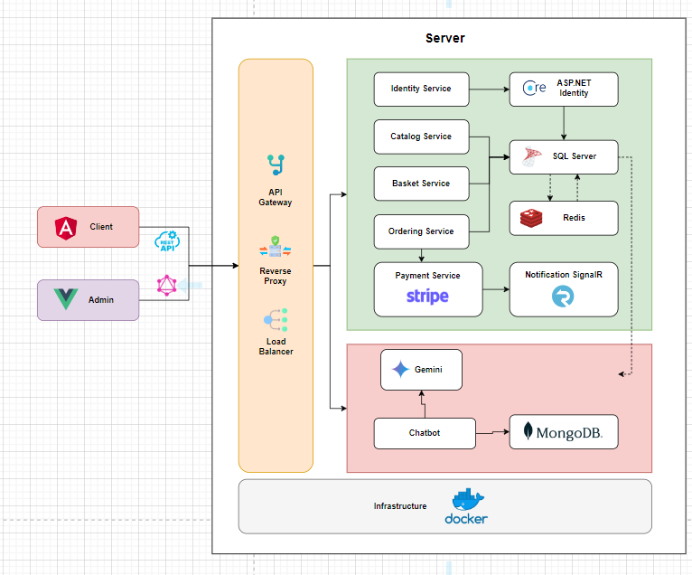

# Iconic Project Repository
This project is an E-Commerce Platform developed using .NET and integrated with Gemini AI to provide a smart chatbot feature. The chatbot enhances the user experience by assisting with product searches, order tracking, and customer inquiries in real-time.
# Features

* Product Catalog: Display and manage product listings with categories and filters.

* Shopping Cart: Add, update, and remove items from the cart.

* Order Management: Track orders and manage shipping details.

* AI Chatbot: Gemini-powered chatbot for instant support and product recommendations.

* User Authentication: Secure login and registration with JWT.

* Payment Integration: Support for multiple payment gateways.

# Tech Stack

* Backend Framework: .NET Core (C#)

* AI Service: Gemini API

* Database: SQL Server

* Authentication: JWT (JSON Web Token)

* Environment Management: dotenv / appsettings.json

# Running the project



You can also run this app locally. To run this project locally you will need to have installed:

1. Docker
2. .Net SDK v8
3. NodeJS (at least version 20.11.1) - Optional if you want to run the Angular app separately in development mode
4. Clone the project in a User folder on your computer by running:

```bash
# you will of course need git installed to run this
git clone https://github.com/nhao2003/iconic-backend.git
cd iconic-backend
```

5. Restore the packages by running:

```bash
dotnet restore

# Change directory to client to run the npm install.  Only necessary if you want to run
# the angular app in development mode using the angular dev server
cd client
npm install
```

6. Most of the functionality will work without Stripe but if you wish to see the payment functionality working too then you will need to create a Stripe account and populate the keys from Stripe. In the API folder create a file called ‘appsettings.json’ with the following code:

```json
{
  "Logging": {
    "LogLevel": {
      "Default": "Information",
      "Microsoft.AspNetCore": "Warning"
    }
  },
  "StripeSettings": {
    "PublishableKey": "pk_test_REPLACEME",
    "SecretKey": "sk_test_REPLACEME",
    "WhSecret": "whsec_REPLACEME"
  },
  "AllowedHosts": "*"
}
```

7. To use the Stripe webhook you will also need to use the StripeCLI, and when you run this you will be given a whsec key which you will need to add to the appsettings.json. To get this key and instructions on how to install the Stripe CLI you can go to your Stripe dashboad ⇒ Developers ⇒ Webhooks ⇒ Add local listener. The whsec key will be visible in the terminal when you run Stripe.
8. Once you have the Stripe CLI you can then run this so it listens to stripe events and forward them to the .Net API:

```bash
#login to stripe
stripe login

# listen to stripe events and forward them to the API
stripe listen --forward-to https://localhost:5001/api/payments/webhook -e payment_intent.succeeded
```

9. The app uses both Sql Server and Redis. To start these services then you need to run this command from the solution folder. These are both configured to run on their default ports so ensure you do not have a conflicting DB server running on either port 1433 or port 6379 on your computer:

```bash
# in the iconic-2024 folder (root directory of the app)
docker compose up -d
```

10. Migration scripts are included in the project so you can run these to create the database and seed the data. You can do this by running:

```bash
cd ./server/Servers/Product
dotnet ef migrations add name -s API -p Infrastructure
dotnet ef database update -s API -p Infrastructure
```

11. You can then run the app and browse to it locally by running:

```bash
# run this from the API folder
cd API
dotnet run
```

12. You can then browse to the app on https://localhost:5001
13. If you wish to run the Angular app in development mode you will need to install a self signed SSL certificate. The client app is using an SSL certificate generated by mkcert. To allow this to work on your computer you will need to first install mkcert using the instructions provided in its repo [here](https://github.com/FiloSottile/mkcert), then run the following command using windows powershell or bash:

```bash
# cd into the client ssl folder
cd client/ssl
mkcert localhost
```

14. You can then run both the .Net app and the client app.

```bash
# terminal tab 1
cd API
dotnet run

# terminal tab 2
ng serve
```

15. Then browse to [https://localhost:4200](https://localhost:4200)
16. You can use the Stripe test cards available from [here](https://docs.stripe.com/testing#cards) to pay for the orders.
